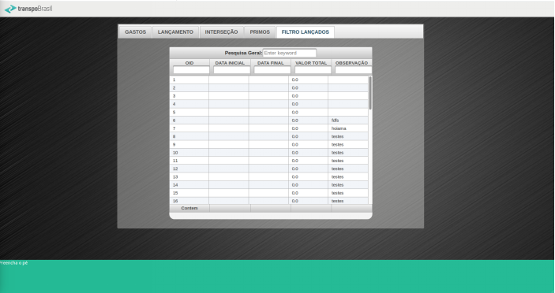
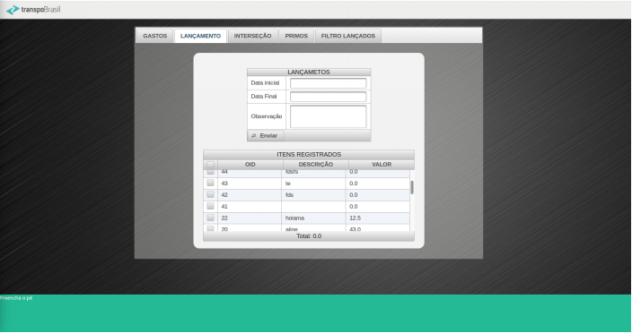
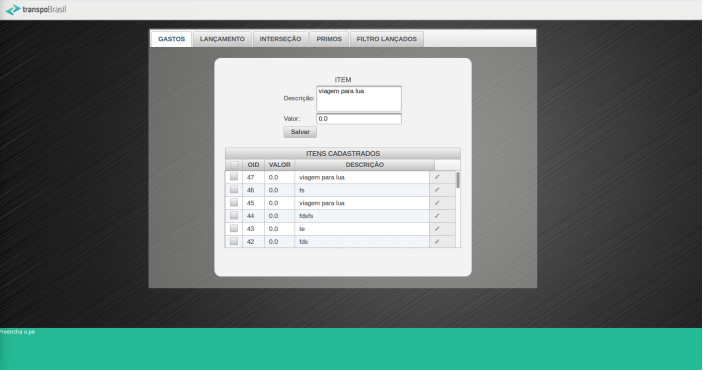
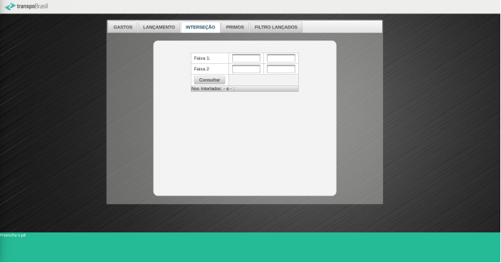
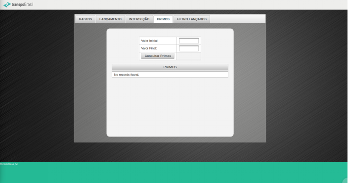

<h2>
 Seletivo_TranspoBrasil (90% concluído)
</h2>

<h3>
 
Seletivo da TranspoBrasil de Santa Catarina..

</h3>

TECNOLOGIAS:

	- JSF
	- Primefaces
	- Hibernate
	- SGDB PostgresSQL
	- Servidor Tomcat 9
	- Maven
 

 

 

 

 

 

OBJETIVO 

	- Crie um projeto Java Web, contendo as camadas MVC. 

	- Na camada de Modelo, deve-se mapear as classes de Lancamento e Item, fazendo
	uso de annotations do Hibernate.

	- Na camada de View, deve-se fazer uso de JSF com Primefaces.

	- Criar uma CRUD para cadastrar itens, podendo informar a descrição e o valor.
	O campo oid deve ser populado através de uma sequence. Exemplo:

	- Criar uma CRUD para cadastrar itens, podendo informar a descrição e o valor

	- Criar uma CRUD para cadastrar lançamentos, podendo informar as datas inicial
	e final (a mascara das datas serão distintas), e o campo de observacao. O campo
	oid deve ser populado através de uma sequence. Deve-se ainda na mesma tela, 
	permitir vincular N itens, criando assim uma mestre X detalhe. O campo total é
	somente leitura, e deve ser populado com o valor total dos itens vinculados ao
	lançamento.

	- Criar uma tela chamada Intersecao, que receba 2 intervalos e retorne uma 
	mensagem em tela informando se existe ou não interserção entre os intervalos. 

	- Criar uma classe na camada de Controle chamada Primos, contendo o método main
	que imprima todos os números primos entre 41 e 5002.

	- Fazer uma consulta para somar o total dos lançamentos, cujo a média dos itens
	foi maior ou igual à R$ 100,00.

	- Fazer uma consulta para trazer os 10 lançamentos que possuam o maior valor de
	itens e tenham a descrição começando com a letra A. Sendo que só devem mostrar 
	lançamentos no qual o somatório desses itens sejam maiores que R$ 50,00.

FALTA CONCLUIR:

	- Injeçao de dependência
	- Validações no backEnd
	- Implementar padrões de projetos
	- Testes
	- Tabela de consultas com primefaces

OBSERVAÇÕES

	Projeto em desenvolvimento.

